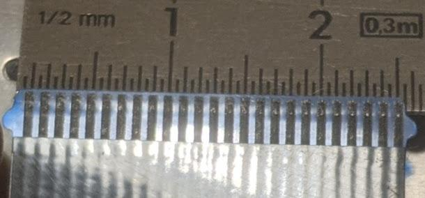

# keyboards-made-external

## Prochaines étapes

* [ ] Acheter le matériel nécessaire
* [x] Comparer le pas de k02 et k03 aux connecteurs FFC de 1 mm.
* [x] Commencer un projet github pour centraliser les notes et mettre des photos

## Matériel nécessaire

* Adaptateur FFC 30 pins de 0,8 mm vers headers classiques (pour k01)
* Adaptateur FFC 24 pins de 0,8 mm vers headers classiques (pour k03)

## Lexique

* FFC : Flexible Flat Cable : en gros, un cable sous forme de nappe plate.
* FPC : Flexible Printed Circuit : ça peut désigner des circuits électroniques sur une surface flexible.

## Liste des claviers

### k01

Ce clavier possède 2 nappes FFC/FPC : l'une pour les frappes clavier, et l'autre pour le rétroéclairage.

Avantages :

* rétroéclairage
* dimensions habituelles (largeur) facilitant la prise en main
* pavé numérique

Ce qui en fait un candidat idéal pour faire un clavier USB nomade ☺️

#### Première nappe de k01

30 pins (dont 2 inutiles) avec un pas de 0,8 mm.

⚠️ les connecteurs FFC avec un pas de 0,8 mm sont beaucoup moins courant !

##### Seconde nappe de k01

4 pins avec un pas de 1 mm.

### k02

Clavier récupéré sur un vieil ordinateur portable de petite taille.

Le clavier est assez compact, réduit en largeur, donc il sera peut-être plus difficile de s'y habituer.
Mais l'avantage c'est qu'il sera assez facilement transportable.

#### Nappe de k02

25 pins (⁉️) avec un pas de 1 mm.

### k03

Clavier récupéré sur un vieil ordinateur portable de petite taille.

Le clavier est assez compact, réduit en largeur, donc il sera peut-être plus difficile de s'y habituer.
Mais l'avantage c'est qu'il sera assez facilement transportable.

J'aime mieux les touches de direction de k02 par rapport à k03.

#### Nappe de k03

24 pins avec un pas de 0,8 mm.